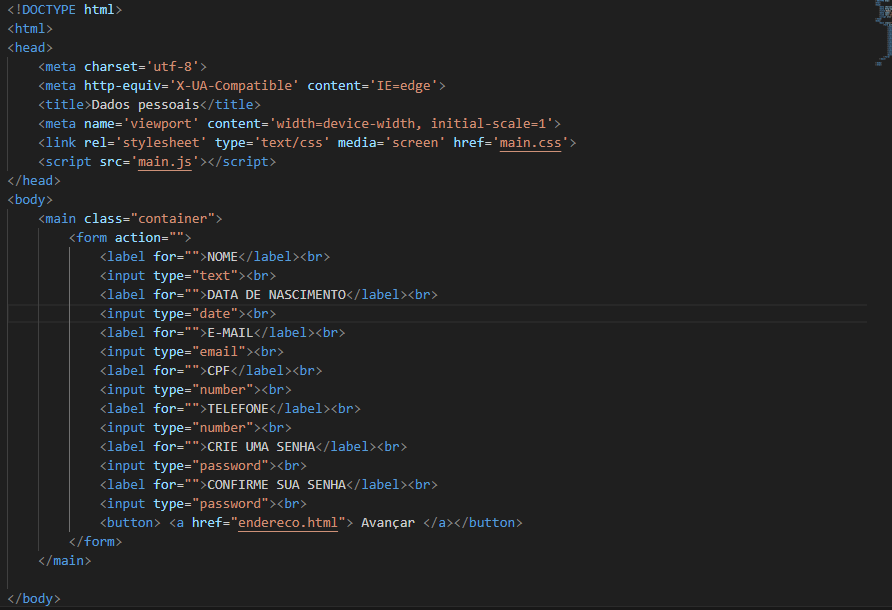

# form-CadEcommerce-
 Projeto criado como parte avaliativa da disciplina de Fundamentos de desenvolvimento ministrada pelo professor Leonardo Rocha.

## Índice
 
* [Descrição](#descrição)
 
* [Tecnologias](#tecnologias)
 
* [Referências](#referências)
 
* [Autor(a)](#autora)
 
 
 
### Descrição
O projeto consiste em criarmos um "site", simulando uma tela de cadastro para realizar uma compra
(Site e-commerce). Nesse projeto é possivel clicar nos botoes e até mesmo preencher todos os campos em branco..
 
#### Tabela
 
 
Segue a imagem da primeira parte do codigo que consiste no inicio do site onde tem que inserir seu nome, telefone, e-mail, cpf e criar uma senha e avançar:
 

 
Segue a imagem da segunda parte do codigo que consiste em inserir seu estado, cidade e endereço e avançar! essa e a segunda etapa para concluir seu cadastro no site:
 

 
Segue a imagem da ultima parte que consiste em se seu cadastro foi conluido no site, ali te parabenizam!
 

 
Segue a imagem da estilizaçao do projeto, consiste nas cor e tamanho do nosso cadastro do site
 

 
### Resultado do projeto
 

 
 
 
 
## Tecnologias
 
* HTML5
 
* CSS3
 
## Referências
 

 
## Autor(a)
 
`O projeto foi desenvolvido por:`
* Sabrina Cardoso Maciel
